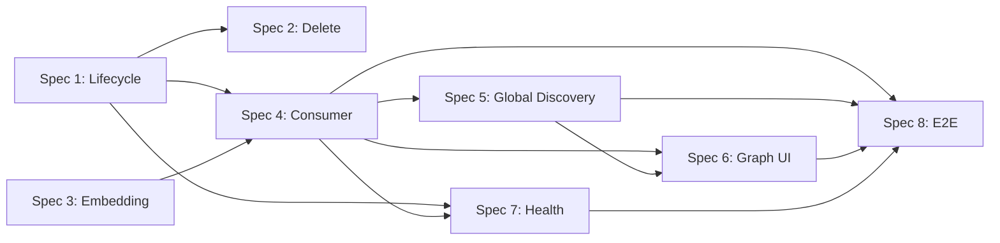

# KG Infrastructure Restructuring — Implementation Roadmap

Derivado das 8 ideações + refinements + specs registradas no Okto Pulse board `c167f5f1-8123-4522-918a-36fcca461538` (Evolution).

Cada spec fica saturada (BRs + scenarios + validation) quando entrar em `in_progress` — este documento é o plano de ordem + breakdown de cards, não a saturação.

---

## Ordem de implementação e racional

| # | Spec | ID | Por que nesta posição |
|---|---|---|---|
| 1 | Lifecycle Kùzu | `7f9feff9` | Foundation: context manager + pool destrava Windows delete, long-running worker, testes com reopen. Pré-req de 2, 4 e 7. |
| 2 | Delete KG atômico | `41261f20` | Quick-win — conserta o sintoma original visível ao usuário (`delete → toast success → nada muda`). Consome lifecycle de #1. |
| 3 | Embedding HuggingFace | `a52ff379` | Pré-req do consumer (nodes precisam de embedding no momento da criação) e da global discovery cross-type. |
| 4 | Consumer cognitivo | `cc3b6e9b` | Peça central que fecha o cognitive loop — sem ela, tudo o mais fica ocioso. Depende de lifecycle + embedding. |
| 5 | Global Discovery cross-type | `57347b7e` | Consome dados populados pelo consumer. Expande `DIGESTED_NODE_TYPES` de 5 para 11. |
| 6 | Graph UI force-layout | `dc9075a9` | Visualiza dados do consumer + global discovery. Frontend-heavy, pode pipelinar parcialmente com #5. |
| 7 | Health dashboard | `53502f9d` | Instrumenta tudo acima. Roda melhor quando há estado real (consumer + outbox + queue) para observar. |
| 8 | E2E integridade | `4aebbbcf` | Umbrella — valida o stack completo funcionando end-to-end. Último porque depende de todos. |

---

## Per-spec card breakdown

Dependências intra-spec são indicadas por `(depends: X.N)`. Dependências cross-spec são indicadas por `(depends: spec-X.Y)`.

### Spec 1 — Lifecycle Kùzu (`7f9feff9`)

| Card | Título | Escopo | Depende |
|---|---|---|---|
| 1.1 | Implementar `BoardConnection` context manager | Classe em `okto_pulse_core/kg/schema.py` com `__enter__`/`__exit__`, gc.collect, best-effort cleanup | — |
| 1.2 | Implementar `ConnectionPool` LRU | OrderedDict + threading.Lock, env `KG_CONNECTION_POOL_SIZE` (default 8, 0 = disabled) | 1.1 |
| 1.3 | Expor `close_global_connection` + `close_all_connections` | Em `global_discovery/schema.py` e `kg/schema.py`, públicos, idempotentes | 1.1 |
| 1.4 | Manter alias deprecado `open_board_connection_raw` | Retorna tupla crua + DeprecationWarning com stacklevel=2 | 1.1 |
| 1.5 | Windows rmtree retry no `governance.right_to_erasure` | `close_all_connections` + gc + sleep(0.05) + retry 3x com backoff 0.1/0.3/1.0s | 1.3 |
| 1.6 | Retrofit call sites | `primitives/*`, `bootstrap/*`, `workers/outbox_worker.py`, `session_manager/*`, testes | 1.1, 1.4 |
| 1.7 | Testes cross-platform | `tests/kg/test_schema_lifecycle.py` + `tests/kg/test_file_handles.py` (psutil) | 1.1, 1.2 |
| 1.8 | CI matrix Linux + Windows | Workflow GitHub Actions `python -W error::ResourceWarning` em ambos runners | 1.7 |

### Spec 2 — Delete KG atômico (`41261f20`)

| Card | Título | Escopo | Depende |
|---|---|---|---|
| 2.1 | `delete_kg_atomic` transação | Remove Kùzu (rmtree) + SQLite (KuzuNodeRef, ConsolidationQueue) + GlobalUpdateOutbox em transação única | spec-1.3, spec-1.5 |
| 2.2 | Retorno estruturado | `{ board_id, deleted_kuzu_nodes, deleted_kuzu_edges, deleted_sqlite_refs, deleted_outbox_events, duration_ms }` | 2.1 |
| 2.3 | Endpoint `DELETE /api/v1/kg/boards/{id}/kg` | Consome novo contrato, retorna JSON, status 200 (com counters) ou 500 (com diagnostic) | 2.2 |
| 2.4 | Toast IDE mostra contadores | `KnowledgeGraphTab.tsx` — toast exibe "X nodes, Y edges, Z outbox events removed in Nms" | 2.3 |
| 2.5 | Teste idempotência | Delete 2x consecutivo não quebra; segundo retorna todos os counters = 0 | 2.1 |
| 2.6 | Teste regressão Windows | Commit recente + delete imediato em Windows não falha com PermissionError | 2.1, spec-1.5 |

### Spec 3 — Embedding HuggingFace (`a52ff379`)

| Card | Título | Escopo | Depende |
|---|---|---|---|
| 3.1 | Adicionar `sentence-transformers` em `pyproject.toml` | Dep obrigatória (não opcional), lock file atualizado | — |
| 3.2 | `HFEmbeddingProvider` singleton | `MiniLM-L6-v2`, lazy load, thread-safe via lock | 3.1 |
| 3.3 | Remover `StubEmbeddingProvider` | Deleta fallback hash-SHA256, atualiza `get_embedding_provider()` | 3.2 |
| 3.4 | Model cache persistente | `~/.okto/models/` com lock file, download no bootstrap com progress log | 3.2 |
| 3.5 | Teste dimensional | Toda chamada retorna vetor 384-dim, mesmo texto → mesmo vetor (determinismo) | 3.2 |
| 3.6 | Teste cross-language PT/EN | Textos similares em PT+EN têm cosine similarity > 0.7 (multilingual validation) | 3.5 |

### Spec 4 — Consumer cognitivo (`cc3b6e9b`)

| Card | Título | Escopo | Depende |
|---|---|---|---|
| 4.1 | Skeleton CLI worker | `okto_pulse_core/kg/consumer/worker.py` asyncio loop, start/stop, SIGTERM handling, single-instance lock | spec-1.1 |
| 4.2 | Claim atômico da fila | `SELECT FOR UPDATE SKIP LOCKED` em PostgreSQL; `BEGIN IMMEDIATE` + row lock em SQLite; fallback a advisory lock se necessário | 4.1 |
| 4.3 | LLM client abstração | Interface `LLMClient.complete(prompt) → str` com implementações OpenAI/Anthropic/ZAI; retries exponenciais (1s/2s/4s, max=3) | 4.1 |
| 4.4 | Skill prompts versionados | `consumer/skills/extract_card.md`, `extract_spec.md`, `extract_ideation.md` + `schema_mapping.md` para 11 node types | — |
| 4.5 | JSON schema validator | `consumer/schema/output_schema.json` valida saída do LLM antes de emitir MCP; rejeita com log se inválido | 4.4 |
| 4.6 | Integração MCP primitives | Orquestra `kg_begin_consolidation` → loop `add_node_candidate` + `add_edge_candidate` → `kg_commit_consolidation` (ou `kg_abort_consolidation`) | 4.3, 4.5, spec-3.2 |
| 4.7 | Failure semantics | Exception → auto-abort; retry_count++ no claim release; 3 fails → dead-letter | 4.6 |
| 4.8 | Webhook opt-in | Se `OKTO_CONSUMER_WEBHOOK_URL` set, enqueue também POST fire-and-forget (extension point) | 4.2 |
| 4.9 | Env config + docs | `OKTO_CONSUMER_ENABLED` (default `false`), `OKTO_LLM_PROVIDER`, `OKTO_LLM_API_KEY`, `OKTO_LLM_MODEL`; doc em `docs/consumer_setup.md` | 4.3 |
| 4.10 | Teste E2E gold card | Card "Decided to use Kùzu because of vector index; supersedes Neo4j eval" → asserir 1 Decision + 1 Supersede edge + DecisionDigest | 4.6 |

### Spec 5 — Global Discovery cross-type (`57347b7e`)

| Card | Título | Escopo | Depende |
|---|---|---|---|
| 5.1 | Expandir `DIGESTED_NODE_TYPES` | `outbox_worker.py:27` de 5 para 11 tipos; update schema do `DecisionDigest` para renomear para `NodeDigest` ou manter nome legacy | — |
| 5.2 | Index por `node_type` | Adicionar secondary index em `DecisionDigest.node_type` no Kùzu para filtros rápidos | 5.1 |
| 5.3 | Backfill CLI command | `okto-pulse kg backfill --board X [--since Y]` itera KuzuNodeRef, cria digest faltante, idempotente | 5.1, spec-4.1 |
| 5.4 | API global filter por tipo | `GET /api/v1/kg/global/search?q=X&node_type=Decision` | 5.2 |
| 5.5 | IDE filtro por tipo em GlobalSearchView | `GlobalSearchView.tsx` — adicionar `<select>` com 11 opções + "all" | 5.4 |
| 5.6 | Teste convergência backfill | Rodar backfill 2x, segundo run produz 0 novos digests | 5.3 |

### Spec 6 — Graph UI force-layout (`dc9075a9`)

| Card | Título | Escopo | Depende |
|---|---|---|---|
| 6.1 | Migrar `GraphCanvas` para React Flow v12 | Substituir implementação atual; adicionar `@xyflow/react` + `d3-force` deps | — |
| 6.2 | 11 custom node components | Um componente por tipo com cor/ícone do `NODE_TYPE_CONFIG` | 6.1 |
| 6.3 | Sidebar filtros por tipo | Checkboxes por `node_type`; atualização reativa do graph | 6.1, 6.2 |
| 6.4 | Edge styling por relação | `supersedes` (tracejado vermelho), `depends_on` (sólido azul), `contradicts` (pontilhado laranja), etc. | 6.1 |
| 6.5 | Focus + fit-to-view no node selecionado | Click em node → center + zoom; URL hash `#node=<id>` | 6.1 |
| 6.6 | Panel de detalhes on click | Mostra supersedence chain, contradictions, similar nodes | 6.5 |
| 6.7 | Mini-map + zoom controls | Componentes do React Flow built-in | 6.1 |
| 6.8 | Teste visual snapshot | 3 boards (pequeno, médio, grande) — visual regression via Playwright | 6.1-6.7 |

### Spec 7 — Health dashboard (`53502f9d`)

| Card | Título | Escopo | Depende |
|---|---|---|---|
| 7.1 | Endpoint `GET /api/v1/kg/health` | Retorna `{ db: {...}, consumer: {...}, embedding: {...}, outbox: {...}, pending_queue: {...} }` com status + últimos timestamps | spec-1.3, spec-4.1 |
| 7.2 | Métricas internas | `last_claim_at`, `avg_processing_time_ms`, `failures_24h`, `entries_processed_24h`, `dead_letter_count` | 7.1 |
| 7.3 | `HealthDashboard.tsx` frontend | Aba nova em Dashboard; auto-refresh 10s; badge por subsistema | 7.1 |
| 7.4 | Status badges green/yellow/red | Regras: green = running + OK; yellow = running + lag > N; red = down ou fails > threshold | 7.3 |
| 7.5 | Metrics Prometheus (opcional) | `/metrics` com `okto_consumer_*` counters; desligado por default via env | 7.2 |
| 7.6 | Toast alertas no IDE | Quando badge vira red, toast com link para aba Health | 7.4 |

### Spec 8 — E2E integridade (`4aebbbcf`)

| Card | Título | Escopo | Depende |
|---|---|---|---|
| 8.1 | Contract test pytest | `tests/e2e/test_kanban_kg_pipeline.py` — create card → enqueue → consumer claim → extract → commit → digest emitted | spec-4.10 |
| 8.2 | Demo board seeder | `okto-pulse seed --demo` cria board com 20 cards canônicos + 5 specs + roda consumer até convergir | spec-4.1 |
| 8.3 | CLI verify command | `okto-pulse kg verify --board X` checa consistência: `KuzuNodeRef == Kùzu nodes`, `outbox processed == digests`, retorna JSON report | 8.1 |
| 8.4 | CI job weekly | GitHub Actions cron `0 2 * * 0` roda demo seeder + verify + reporta diffs | 8.2, 8.3 |
| 8.5 | Golden assertions doc | `docs/kg_golden_assertions.md` — invariantes do sistema (toda entry processada tem digest, todo digest tem KuzuNodeRef, etc.) | 8.3 |
| 8.6 | Recovery playbook | `docs/kg_recovery.md` — como diagnosticar e reparar drift detectado pelo verify | 8.5 |

---

## Cross-spec dependency graph

Caminho crítico: **S1 → S3 → S4 → S8**. Tudo o mais pode pipelinar parcialmente uma vez que S4 esteja funcional.

---

## Modo de saturação recomendado

Antes de iniciar a implementação de uma spec:

1. Mover a spec de `draft` → `review` → `approved`.
2. Adicionar business rules cobrindo FRs (`okto_pulse_add_business_rule` com `linked_requirements`).
3. Adicionar test scenarios cobrindo ACs (`okto_pulse_add_test_scenario` com `linked_criteria`).
4. Submeter validação (`okto_pulse_submit_spec_validation`).
5. Mover `validated` → `in_progress` → `done` (done é quando os cards começam a ser executados).
6. Criar os cards conforme breakdown acima (`okto_pulse_create_card` com `spec_id` + `title` + `description` + `priority`).
7. Encadear dependências (`okto_pulse_add_card_dependency`).
8. Implementar.

O board já teve `skip_test_coverage` removido, então a saturação agora exige apenas BRs para FRs — não exige test cards para scenarios.

---

## Total estimado

- **8 specs** × ~6-8 cards = **~50-60 cards** de implementação
- **~15-20 cards** com dependências cross-spec explícitas
- Caminho crítico (S1→S3→S4→S8): ~25 cards
- Trabalho paralelizável após S4 done: Specs 5, 6, 7 simultaneamente (~20 cards)

Gerado em 2026-04-16 a partir do board `c167f5f1-8123-4522-918a-36fcca461538`.
